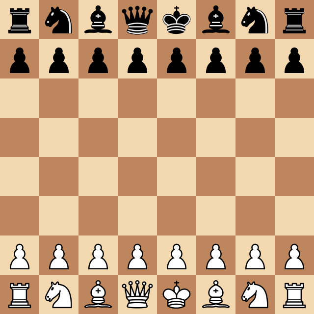

- 👋 Hi, I’m @imanousar
- 👀 I’m interested in Machine learning, Soft Eng
- 📕 Learning AWS
- ♞ Challenge me  in lichess - [@link97](https://lichess.org/@/link97

               

##  My GitHub stats

  

    
    
  

